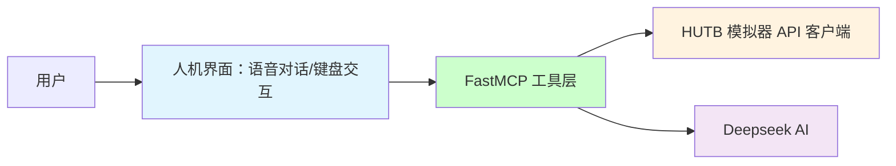
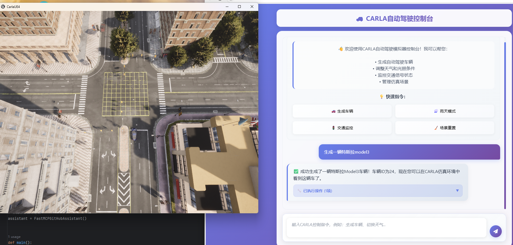

# HUTB 的 MCP 实现

基于 MCP 实现和具身人、无人车、无人机的大模型交互。

## 🏗️ 项目架构

## 1、实现
## 集成版
能够在未安装Python和UE4的情况下启动
1. 下载 [发布页面](https://github.com/OpenHUTB/hutb/releases) 中的对应的文件并解压
2. 下载 [虚拟环境、启动脚本及MCP文件](https://pan.baidu.com/s/1TNH-9wZYNy4NhmWJSoZL5A?pwd=hutb)中的`env.UE4-hutb.zip` `llm.zip` `hutb.bat`文件，解压到`WindowsNoEditor`文件夹下，确认项目结构如下所示
- 项目结构
WindowsNoEditor/  
├── UE4-hutb/                        
├── llm/ 
│   └── .env
├── CarlaUE4.exe            
└── hutb.bat            
3. 检查 `llm/.env` 文件中的Github和Deeopseek API密钥已配置
4. 双击 `hutb.bat` 启动模拟器

### 1.1 大模型

[基于FastMCP框架的 HUTB 智能助手](llm/README.md) 。

### 1.2 流程
加上语音识别和合成的整个工作流依次包括：[麦克风](https://item.m.jd.com/product/100025694525.html) /Web浏览器、 [语音](https://mp.weixin.qq.com/s?src=11&timestamp=1754125763&ver=6150&signature=6MJAq932niAOOc0qQSU0kuIulTwbkRstev6RvAM0Q*v*bGEZEINUcdtIN4zu23ZW71o0-GD1OB7DU7YjJcCqaWt6Iv63U4SKUIy1z1cK3khakAGz-BcQuDzPMdsJEK9P&new=1) 识别（方言、老人言： PaddleSpeech ）、QWen/DeepSeek 大模型、流式语音合成 PP-TTS （语音播报/控制模拟器的模型或实体机器人）。

### 1.3 其他：[人形机器人模拟环境搭建](./model/humanoid.md)

## 参考

* [基于FastMCP框架的 Github 助手](https://github.com/wink-wink-wink555/ai-github-assistant)

* [carla-mcp](https://github.com/shikharvashistha/carla-mcp)

* [网易云音乐 MCP 控制器](https://modelscope.cn/mcp/servers/lixiande/CloudMusic_Auto_Player)

* [机器人本体的仿真环境使用教程](https://kuavo.lejurobot.com/manual/basic_usage/kuavo-ros-control/docs/4%E5%BC%80%E5%8F%91%E6%8E%A5%E5%8F%A3/%E4%BB%BF%E7%9C%9F%E7%8E%AF%E5%A2%83%E4%BD%BF%E7%94%A8/) 
* [机器人本体三维模型](https://gitee.com/OpenHUTB/kuavo-ros-opensource/tree/master/src/kuavo_assets/models)
* [基于虚幻引擎的PR2机器人集成和调试](sim/README.md)（根据 [OpenSim](https://github.com/OpenHUTB/move) 建模）

* [训练MuJoCo和真实人形机器人行走](https://github.com/rohanpsingh/LearningHumanoidWalking) 
